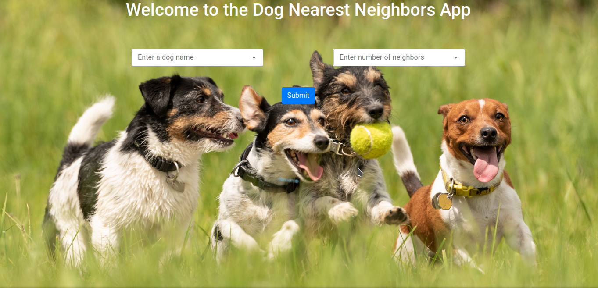

# Dog KNN
A basic app that returns the `k` nearest neighbors of a selected dog breed using the variables no. of genetic ailments, weight (kg), and shoulder height (cm).

The app can be viewed at [dogneighbors.tk](https://dogneighbors.tk).

This project was bootstrapped with [Create React App](https://github.com/facebook/create-react-app).

## Getting started
Install [Nodejs](https://nodejs.org/en/), [Yarn](https://yarnpkg.com/), [Python](https://www.python.org/) (>=3.5), [Docker](https://docs.docker.com/get-docker/), and [Docker Compose](https://docs.docker.com/compose/install/). 

Note that your `nodejs` version should be above 16. Instructions for installing various versions are [here](https://github.com/nodesource/distributions/blob/master/README.md#debinstall).

Clone the repo and create a virtual environment in the `api` folder with `python3 -m venv .venv`.

Activate the virtual environment with `source api/.venv/bin/activate`. Install the requirements with `pip install -r api/requirements.txt`.

To set the environment variables, create a file `api/.flaskenv` that contains 
```
FLASK_APP=api.py
FLASK_ENV=development
DOCKER_DEPLOY=1
```

You can also create a `.env` file that has 
```
DOCKER_CLIENT_TIMEOUT=1000
COMPOSE_HTTP_TIMEOUT=1000
```

This can be helpful for slower internet connections. 

## Running the app
Start the app locally by running `docker-compose -f docker-compose.yml up --build -d`. The app will be available on `localhost:3000`. The `--build` option can be omitted on subsequent runs of `docker compose` once images have been built.



### Running the app without Docker
Note that by setting `DOCKER_DEPLOY=0` in the `api/.flaskenv` or `.env` file, the app will not run inside a Docker container. To run the app without Docker, use `yarn start` in the current terminal. Then open up a second terminal, activate the virtual environment with `source api/.venv/bin/activate`, and type `yarn start-api`. This will start the `Flask` backend that returns predictions.

## Deployment
Follow the steps for cloning a repo to an EC2 instance [here](https://stackoverflow.com/questions/51380792/git-clone-ec2-instance-permissions-error). Run `./setup-server.sh` to install `docker` and `docker compose` on the instance. Then use `docker compose -f docker-compose.prod.yml up -d --build` to start the app.  

## Data Source
The data was sourced from the [American Kennel Club](https://docs.google.com/spreadsheets/d/1l_HfF5EaN-QgnLc2UYdCc7L2CVrk0p3VdGB1godOyhk/edit#gid=10). It is also described in this blog [post](https://www.informationisbeautiful.net/visualizations/best-in-show-whats-the-top-data-dog/).
